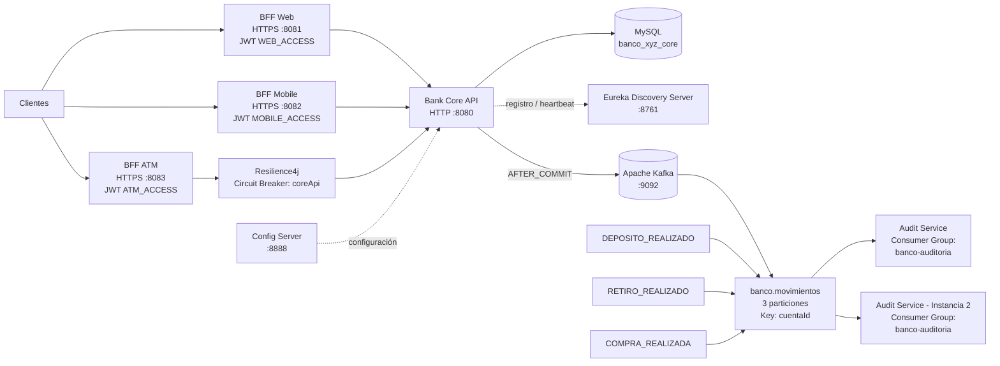

# Diagrama de Arquitectura - Banco XYZ
## Exp3 - Semana 7



## Flujo principal

```text
Cliente
  ↓
BFF
  ↓
Bank Core API
  ↓
MySQL
  ↓
COMMIT exitoso
  ↓
Evento interno
  ↓
KafkaMovimientoPublisher
  ↓
banco.movimientos
  ↓
Audit Service
```

## Tópico y eventos

**Tópico:**

```text
banco.movimientos
```

**Particiones:**

```text
3
```

**Key:**

```text
cuentaId
```

**Eventos:**

```text
DEPOSITO_REALIZADO
RETIRO_REALIZADO
COMPRA_REALIZADA
```

## Escalabilidad

```text
Consumer Group: banco-auditoria

Consumidor 1 -> particiones 0 y 1
Consumidor 2 -> partición 2
```

Kafka realiza automáticamente el rebalanceo cuando una nueva instancia de `audit-service` entra o sale del grupo.

## Resiliencia

```text
BFF ATM
  ↓
Resilience4j
  ↓
Bank Core API
```

Estados validados del Circuit Breaker:

```text
CLOSED -> OPEN -> HALF_OPEN -> CLOSED
```

Cuando el Core API no está disponible:

```text
HTTP 503
CORE_NO_DISPONIBLE
```

## Servicios de soporte

```text
Config Server :8888
Eureka        :8761
Kafka         :9092
Core API      :8080
BFF Web       :8081
BFF Mobile    :8082
BFF ATM       :8083
```
